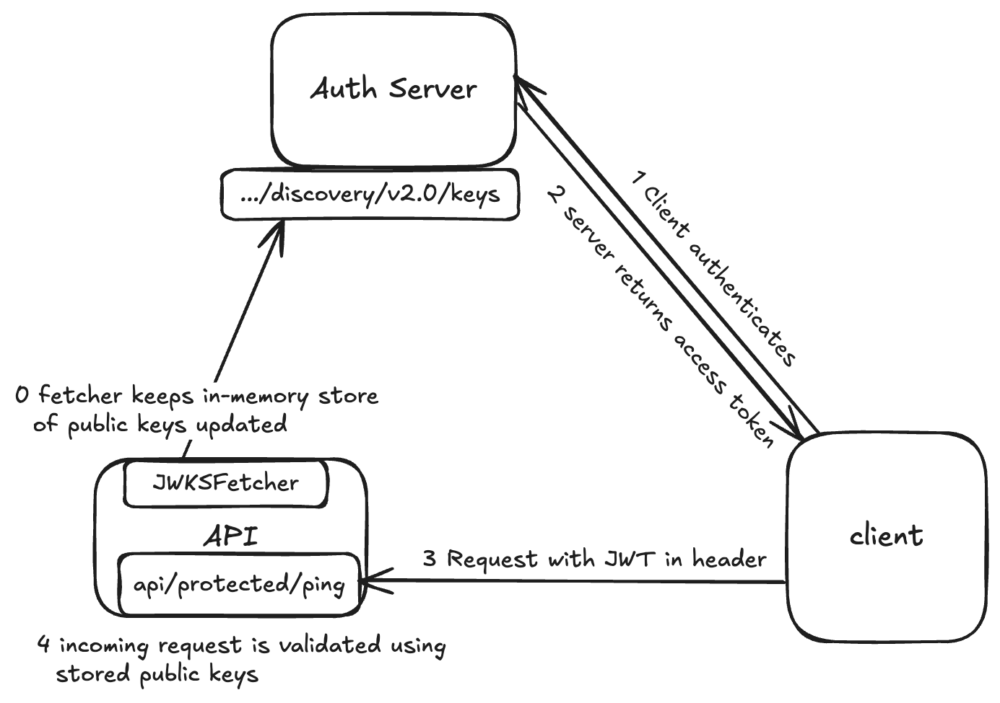

# Go JWKS Fetcher and JWT Validator

A go package for fetching JSON Web Key Sets (JWKS) from an authroization server
and validating JSON Web Tokens (JWTs) using these keys. It includes HTTP middleware for integration 
with web services.

## Features
*   **JWKS Fetching:** Retrieves JWKS from a specified discovery URL (e.g. Microsoft Entra ID discovery endpoint).
*   **Automatic Key Rotation:** Periodically fetches the JWKS endpoint to ensure keys are up-to-date.
*   **JWT Validation:**
    *   Verifies the JWT signature using the public key corresponding to the `kid` (Key ID) in the token header.
    *   Validates the `alg` (algorithm) used for signing against a configurable list.
    *   Validates the `aud` (audience) claim against a configurable list of allowed audiences.
    *   Validates the `iss` (issuer) against the configured issuer. 
*   **HTTP Middleware:** Provides standard Go `http.Handler` middleware to protect endpoints.
*   **RSA Support:** Currently supports JWTs signed with RSA algorithms. 

## Installation
```bash
go get github.com/intility/go-jwks
```


## Example
```go
package main

import (
	"context"
	"fmt"
	"log/slog"
	"net/http"
	"time"

	jwks "github.com/intility/go-jwks"

	"github.com/golang-jwt/jwt/v5"
)

func main() {
	ctx, cancel := context.WithCancel(context.Background())
	defer cancel() 

	// The NewJWKSFetcher takes a keysource to fetch public keys.
	// The keySource interface is satisfied by EntraID and Generic.
	// Optionally set other parameters using functional options.
	fetcher, err := jwks.NewJWKSFetcher(jwks.EntraID{TenantID: "your-tenant-id"})
	if err != nil {
		slog.Error("failed to create fetcher", "error", err)
	}

  // Start fetching JWKS (performs initial fetch synchronously)
	if err := fetcher.Start(ctx); err != nil {
		slog.Error("failed to start JWKS fetcher", "error", err)
		return
	}

	// Configure JWT Validator
	audiences := []string{"api://YOUR_API_CLIENT_ID"}

	// Specify allowed signing algorithms
	validMethods := []string{jwt.SigningMethodRS256.Alg()}

	// Specify you issuer
	issuer := "https://auth.example.com"

	// Create the JWT Validator instance
	validator := jwks.NewJWTValidator(fetcher, issuer, audiences, validMethods)

	// Create the HTTP Middleware
	jwtMiddleware := jwks.JWTMiddleware(validator)

	mux := http.NewServeMux()

	// Apply the middleware to protected routes
	mux.Handle("/api/protected/ping", jwtMiddleware(http.HandlerFunc(pingHandler)))

	slog.Info("Server starting on :8080")
	if err := http.ListenAndServe(":8080", mux); err != nil {
		slog.Error("Server failed", "error", err)
	}
}

func pingHandler(w http.ResponseWriter, r *http.Request) {
	w.Header().Set("Content-Type", "application/json")
	fmt.Fprintf(w, `{"message": "pong"}`)
}
```

## Key fetching/synchronization
In the oauth2 protocol, the client will receive an access token signed
by an authorization server. This token can then be included in the request header sent to the server.
When the server receives this request, it needs to verify its signature using the public key from the authorization server.
These keys are rotated often, and such the server must reach out the authorization server
periodically to refresh its local key store. This synchronization is handled by the JWTFetcher running in the background.



## JWT validation
To start validating JWTs, create a JWTValidator instance with the NewJWTValidator function.
This object holds the in-memory store of JWKS from the fetcher, allowed audiences and valid singing methnods specified by the user.

Passing this validator to the JWTMiddleware function returns a http.HandlerFunc middleware ready to authenticate incoming requests.
The middleware expects a "Authorization: Bearer \<token>" jwt header.

## TODO
Add support for EC (Elliptic Curve) key types (kty: "EC") and algorithms.

